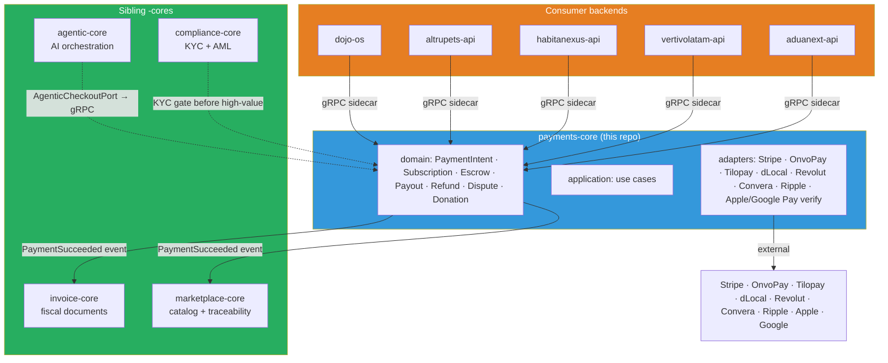

# Design — Governance rubric adoption

## Shape of the change

This change is **documentation-only**. It creates two artifacts and modifies zero runtime code:

1. The OpenSpec change directory itself (`openspec/changes/governance-rubric-adoption/` with the three conventional files).
2. A companion page in the published docs site at `docs/content/docs/governance/index.md` that mirrors the verdict in a reader-friendly format for non-contributors.

## Why two copies

The OpenSpec change captures the decision frozen at a point in time — once merged, it does not drift. The MkDocs page is the living surface that a reader consumes; it links back to the OpenSpec change as its source of truth.

This mirrors the pattern in `aduanext` (where OpenSpec changes live in `openspec/changes/` and surface in `docs/content/docs/`) and in `agentic-core` (same pattern).

## Content outline for the MkDocs page

Suggested headings:

1. **Why this repository exists** — one paragraph, rubric summary.
2. **Verdict table** — same 5×2 table as `proposal.md`.
3. **Scope boundaries** — the in/out list from `proposal.md`.
4. **Siblings** — one short paragraph per sibling (`agentic-core`, `marketplace-core`, `invoice-core`, `compliance-core`) describing what they own and how `payments-core` collaborates.
5. **Anti-patterns we avoid** — copied from §9 of the ecosystem rubric, contextualized to payments.

The page is short (target: 500–800 words). It does not duplicate the full design; its job is orientation.

## Diagram

## What is intentionally NOT in this change

- No code. No `package.json`, no `tsconfig`, no proto file. Those live in separate OpenSpec changes (`repo-bootstrap`, `proto-contract-v1`, `domain-skeleton`).
- No adapter documentation. Adapter-specific pages land with their respective adapter changes.
- No changes to sibling repos. The rubric update to the ecosystem document outside this repo is done as a manual commit by the maintainer once this change merges, because the ecosystem document is not under source control in any single repo.

## Risk

Very low. Documentation-only. The only way this change can go wrong is drift: if someone later edits the rubric verdict here without editing the ecosystem document, the two will disagree. Mitigation: the `proposal.md` §Acceptance lists "ecosystem rubric updated" as a required step.

## Rollback

`git revert` the merge commit. No data, no external systems affected.
